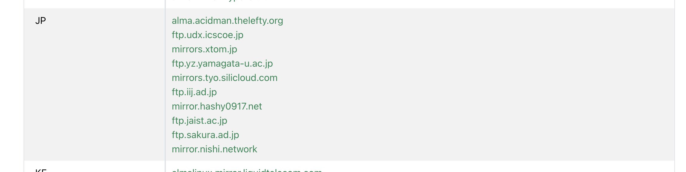
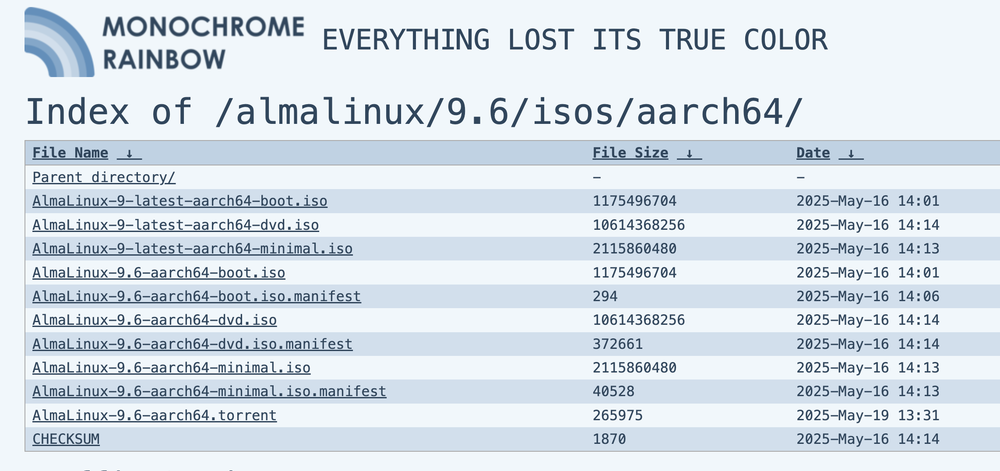

# Mac で UTM を使って AlmaLinux をインストールする手順

## 1. UTM のダウンロードとインストール

---

## 📚 [全体の目次に戻る](README.md)

1. UTM 公式サイトにアクセス  
   [https://mac.getutm.app/](https://mac.getutm.app/)

2. 最新バージョンの UTM をダウンロード

   - 「Download」ボタンをクリック
   - 「UTM for macOS」を選択

3. ダウンロードした `.dmg` ファイルを開く

   - 「UTM.app」を「アプリケーション」フォルダにドラッグ＆ドロップしてコピー

4. UTM を起動
   - 初回起動時に警告が出た場合は  
     「システム環境設定」→「セキュリティとプライバシー」→「一般」タブから「開く」を許可

---

# Mac（M1 / Apple Silicon）で使う AlmaLinux ISO の選び方

## 推奨 ISO

- **ファイル名**：`AlmaLinux-9.6-aarch64-dvd.iso`
- **理由**:
  - **aarch64** … Apple M1 チップは ARM64 アーキテクチャなので必須
  - **dvd.iso** … 完全版インストーラー。ネット接続がなくてもインストール可能でトラブルが少ない
  - **9.6** … 現行の安定版。教材学習や実運用に向く

## ダウンロード手順

1. AlmaLinux 公式ミラー一覧ページへアクセス

   - https://mirrors.almalinux.org/isos.html

2. `aarch64` ディレクトリの version **9.6** を選択

3. JP のリンクを選ぶ(基本的にどれでも問題は無い)

4. `AlmaLinux-9.6-aarch64-dvd.iso` をダウンロード

## 注意

- M1/M2 Mac では **x86_64 版は動かない** ので必ず `aarch64` を選択

---

## 3. UTM で AlmaLinux 仮想マシンを作成

1. UTM を起動し、左上の「＋」ボタンで新規作成

2. 「仮想マシンの作成」画面で以下を設定

   - 仮想化を選ぶ
   - Operating System: `Linux`
   - 名前: `AlmaLinux`（任意）
   - 「Apple 仮想化を使用」を選ぶ
     (Apple Silicon Mac（M1 / M2）で UTM を使う場合)

3. メモリ: 2048MB（2GB）以上推奨
4. CPU コア数: 2 コア以上推奨

5. ストレージの追加

   - 「ドライブ」セクションで新規 VirtIO の仮想ディスクを作成（20GB 以上推奨）

6. CD/DVD ドライブに ISO をマウント

   - 先ほどダウンロードした `AlmaLinux-xxx.iso` を指定

7. ネットワークは基本設定（NAT）で OK

8. 設定を保存して仮想マシンを起動

---

## 4. AlmaLinux のインストール手順

1. 仮想マシンが起動し、ISO からインストール画面が表示される

2. インストールウィザードの指示に従い、言語やキーボード、タイムゾーンを設定

3. ストレージ選択で VirtIO 仮想ディスクを指定

4. root パスワードやユーザーアカウントを作成

5. インストール開始 → 完了まで待機（数分〜十数分）

6. インストール完了後、仮想マシンを再起動

---

## 5. ISO イメージの取り外し（重要）

1. インストール完了後、仮想マシンの設定画面を開く

2. **重要**「CD/DVD」セクションの ISO を **「なし」または空に設定**して取り外す

3. 保存して仮想マシンを再起動

---

## 6. AlmaLinux の初回起動とログイン

1. 仮想マシン起動後、AlmaLinux ログイン画面が表示される

2. 作成したユーザー名・パスワードでログイン

---

# 補足

- AlmaLinux は CentOS 互換の安定した Linux ディストリビューションです
- VirtIO ドライブは高速で安定した仮想ストレージとして推奨です
- USB ドライブは外部ストレージ用途で使われます
- インストール後は必ず ISO を外して、仮想ディスクから起動するようにしてください
