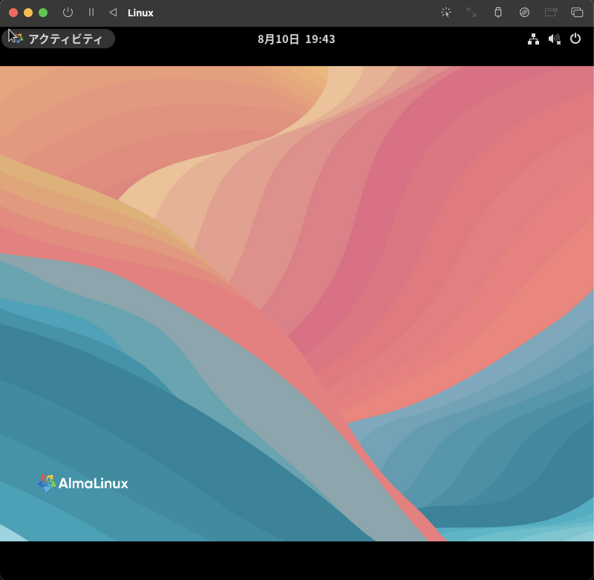

# 第 1 章 『Linux を操作してみる』

## Apache（httpd）のインストール補足

教材環境によっては **Apache HTTP Server（httpd）** が事前にインストール済みの前提になっています。

UTM 上に自分で AlmaLinux をインストールした場合、`httpd` は標準で含まれていないため、
以下の手順でインストールする必要があります。

---

## 1-1 インストール手順

1. **root 権限に切り替える**（または `sudo` を使用）

   ```bash
   sudo -i

   ```

2. Apache をインストール
   sudo dnf install httpd

3. サービスを起動
   sudo systemctl start httpd

4. 自動起動を有効化（任意）
   sudo systemctl enable httpd

5. サービス状態の確認
   systemctl status httpd

   ```

   ```

## 端末（ターミナル）の起動方法

1. 画面左上の **「アクティビティ」** をクリックする
2. 表示された画面で **端末アイコン（Terminal）** を探してクリックする
   - 端末アイコンは黒い画面に「>\_」や「端末」と書かれていることが多い
3. 端末が開くと、コマンドを入力できる状態になる

---



## ターミナルを使った基本操作の準備

- ターミナルが開いたら、Linux の基本操作をコマンドラインで進められるようになる
- GUI 操作だけでなく、端末からの操作に慣れることが目的

---

# 1-2 Web サーバーを動かしてみる

Linux では、`systemctl`コマンドを使ってサービスの起動や停止を行います。  
ここでは、AlmaLinux にインストールした Web サーバー（`httpd`サービス）を起動し、Web ブラウザからアクセスする手順を説明します。

---

## Web サーバーを起動する

- Web サーバーは`httpd`サービスとして管理されている
- サービスの起動には管理者権限（root 権限）が必要
- `systemctl start httpd` コマンドで起動できる
- 実行時に管理者権限の確認でユーザーのパスワード入力が求められる（管理者権限を持つユーザーでログインしている必要がある）

---

## 起動確認とコマンド履歴の活用

- 起動後は `systemctl status httpd` コマンドでサービスの状態を確認する
- コマンド履歴機能を使うと、以前実行したコマンドを上下カーソルキーで呼び出せる
- コマンドの修正もカーソルキーと Delete/Backspace で可能

---

この操作により、Web サーバーを起動し、管理者権限の確認やコマンドの効率的な利用方法を理解できます。
