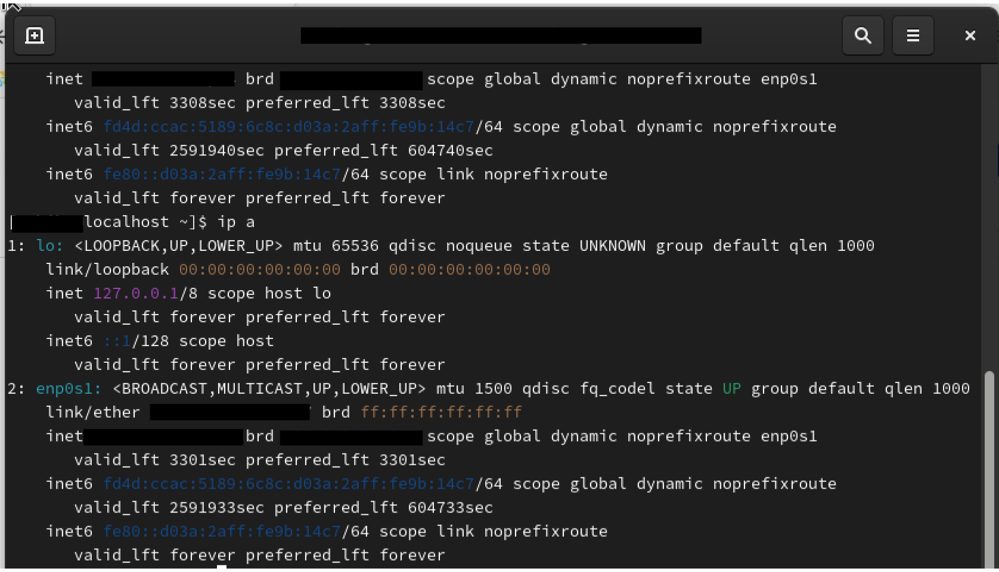

# 第 1 章 『Linux を操作してみる』

---

## 📚 [全体の目次に戻る](README.md#各章リンク)

## 章の概要

本章では、Linux を初めて操作する方向けに、基本的な操作環境の準備と Web サーバーの起動・停止、SSH を使ったリモート接続までの手順を学びます。

- Apache HTTP Server（httpd）のインストール補足
- ターミナルの起動と基本操作の準備
- Web サーバーの起動・停止の確認方法
- SSH を使ったリモートログイン方法
- Windows から Linux 仮想マシンへの接続手順

これらを理解することで、Linux 環境での操作に慣れ、基本的な管理やリモート操作ができるようになります。

---

## 目次

- [1-0 Apache（httpd）のインストール補足](#1-0-apachehttpdのインストール補足)
- [1-1 インストール手順](#1-1-インストール手順)
- [1-2 端末（ターミナル）の起動方法](#1-2-端末ターミナルの起動方法)
- [1-3 ターミナルを使った基本操作の準備](#1-3-ターミナルを使った基本操作の準備)
- [1-4 Web サーバーを動かしてみる](#1-4-web-サーバーを動かしてみる)
  - [1-4-1 Web サーバーを起動する](#1-4-1-web-サーバーを起動する)
  - [1-4-2 起動確認とコマンド履歴の活用](#1-4-2-起動確認とコマンド履歴の活用)
  - [1-4-3 Web サーバーを停止してみる](#1-4-3-web-サーバーを停止してみる)
- [1-5 SSH でリモートログインする](#1-5-ssh-でリモートログインする)
- [1-6 Windows から SSH で接続する方法](#1-6-windows-から-ssh-で接続する方法)
- [1-7 Windows のコマンドプロンプト起動](#1-7-windows-のコマンドプロンプト起動)
- [1-8 ssh コマンドでゲスト OS に接続](#1-8-ssh-コマンドでゲスト-os-に接続)

---

## Apache（httpd）のインストール補足

教材環境によっては **Apache HTTP Server（httpd）** が事前にインストール済みの前提になっています。

UTM 上に自分で AlmaLinux をインストールした場合、`httpd` は標準で含まれていないため、
以下の手順でインストールする必要があります。

---

## 1-1 インストール手順

1. **root 権限に切り替える**（または `sudo` を使用）

   ```bash
   sudo -i

   ```

2. **Apache をインストール**

   ```bash
   sudo dnf install httpd

   ```

3. **サービスを起動**

   ```bash
   sudo systemctl start httpd

   ```

4. **自動起動を有効化（任意）**

   ```bash
   sudo systemctl enable httpd
   ```

5. **サービス状態の確認**

   ```bash
   systemctl status httpd

   ```

## 1-2 端末（ターミナル）の起動方法

1. 画面左上の **「アクティビティ」** をクリックする
2. 表示された画面で **端末アイコン（Terminal）** を探してクリックする
   - 端末アイコンは黒い画面に「>\_」や「端末」と書かれていることが多い
3. 端末が開くと、コマンドを入力できる状態になる

---


## 1-3 ターミナルを使った基本操作の準備

- ターミナルが開いたら、Linux の基本操作をコマンドラインで進められるようになる
- GUI 操作だけでなく、端末からの操作に慣れることが目的

---

## 1-4 Web サーバーを動かしてみる

Linux では、systemctl コマンドを使ってサービスの起動や停止を行います。
ここでは、AlmaLinux にインストールした Web サーバー（httpd サービス）を起動し、Web ブラウザからアクセスする手順を説明します。

## 1-4-1 Web サーバーを起動する

Web サーバーは httpd サービスとして管理されている

サービスの起動には管理者権限（root 権限）が必要

systemctl start httpd コマンドで起動できる

実行時に管理者権限の確認でユーザーのパスワード入力が求められる（管理者権限を持つユーザーでログインしている必要がある）

## 1-4-2 起動確認とコマンド履歴の活用

起動後は systemctl status httpd コマンドでサービスの状態を確認する

コマンド履歴機能を使うと、以前実行したコマンドを上下カーソルキーで呼び出せる

コマンドの修正もカーソルキーと Delete/Backspace で可能

## 1-4-3 Web サーバーを停止してみる

systemctl stop httpd コマンドで Web サーバーを停止する

実行時にユーザー（管理者権限を持つ）パスワードの認証が求められる

停止後、systemctl status httpd を確認すると「Active: inactive (dead)」となる

Web ブラウザで再読み込みすると「正常に接続できませんでした」と表示される

必要に応じて systemctl start httpd で再起動し、正常に戻ることを確認する

コマンド履歴やコマンドライン編集機能を使って操作の効率化を試みる

## 1-5 SSH でリモートログインする

Linux マシンが手元にない場合、SSH でリモートログインして操作する

本教科書は基本的に GUI からのログインだが、リモート操作に慣れるため SSH 利用を推奨

事前に Linux で ip a コマンドを実行し、ログイン先の IP アドレスを確認する



仮想マシンにはネットワークアダプターが 2 つ設定されている

自分自身に接続する「ローカルループバック」を含め、3 つのネットワークインターフェースが表示される

IP アドレスは「inet」で始まる行に記載されている

例：192.168.56.3/24 はホストオンリーネットワークの IP アドレスで、DHCP により第 4 オクテットは変動する可能性がある

ホスト OS とゲスト OS はホストオンリーネットワーク経由で接続される

SSH のログイン先 IP アドレスはこの「192.168.56.x」になる

## 1-6 Windows から SSH で接続する方法

Windows から仮想マシンの Linux に SSH でログインするには SSH クライアントが必要

方法は主に 2 つ

コマンドプロンプトや PowerShell で標準の ssh コマンドを使う

Tera Term などの SSH 対応ソフトを使う

ここでは Windows 標準の ssh コマンドを使用

## 1-7 Windows のコマンドプロンプト起動

タスクバーの検索で「cmd」と入力して「コマンドプロンプト」を起動

検索ウインドウが無い場合はタスクバー設定から表示を有効にする

## 1-8 ssh コマンドでゲスト OS に接続

書式：ssh ユーザー名@接続先 IP アドレス

例：ssh linuc@192.168.56.3

初回接続時にホストの認証確認が出るので YES を入力

パスワード入力を求められる（非表示）ので、ユーザー linuc のパスワードを入力

接続成功すると Linux のシェルが使える状態になる

---

◀ [0 章へ](00_install.md) | 📚 [全体の目次](README.md#各章リンク) | [2 章へ](02_basic_commands.md) ▶

---
