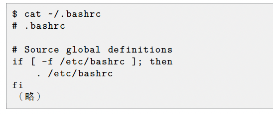

# 第 2 章 『基本的なコマンド』

---

## 📚 [全体の目次に戻る](README.md#各章リンク)

## 章の概要

Linux での基本操作は **ファイルやディレクトリの操作** が中心です。  
本章では、これらの基本操作を理解し、実践できるようになることを目標とします。

## 本章の目次

1. [2-1 ファイルとディレクトリの参照](#2-1-ファイルとディレクトリの参照)
   1. [2-1-2 ls コマンドによる参照](#2-1-2-ls-コマンドによるファイルやディレクトリの参照)
   2. [2-1-3 コマンドの構成要素](#2-1-3-コマンドの構成要素)
   3. [2-1-4 オプションの要約](#2-1-4-要約)
   4. [2-1-5 サブコマンド](#2-1-5-サブコマンド要約)
   5. [2-1-6 引数](#2-1-6-引数ひきすう)
   6. [2-1-7 ls -l コマンドの実行](#2-1-7-ls--l-コマンドの実行)
   7. [2-1-8 ドットファイルの表示](#2-1-8-ドットファイルの表示)
   8. [2-1-9 オプションの同時指定と順序](#2-1-9-オプションの同時指定と順序)
   9. [2-1-10 ワイルドカードを使った絞り込み](#2-1-10-ワイルドカードを使った絞り込み)
2. [2-2 ファイルの内容を表示](#2-2-ファイルの内容を表示)
3. [2-3 空のファイルを作成する（touch コマンド）](#2-3-空のファイルを作成するtouch-コマンド)
4. [2-4 ディレクトリの操作](#2-4-ディレクトリの操作)
   1. [2-4-1 カレントディレクトリの表示（pwd コマンド）](#2-4-1-カレントディレクトリの表示pwd-コマンド)
   2. [2-4-2 ディレクトリの変更（cd コマンド）](#2-4-2-ディレクトリの変更-cd-コマンド)
   3. [2-4-3 ディレクトリの作成（mkdir コマンド）](#2-4-3-ディレクトリの作成-mkdir-コマンド)
   4. [2-4-4 ディレクトリの削除（rmdir コマンド）](#2-4-4-ディレクトリの削除-rmdir-コマンド)
   5. [2-4-5 rm -r コマンドによる一括削除](#2-4-5-rm--r-コマンドによるディレクトリとファイルの一括削除)
5. [2-5 特別なディレクトリとパスの指定](#2-5-特別なディレクトリとパスの指定)
6. [2-6 ファイルのコピー（cp コマンド）](#2-6-ファイルのコピー-cp-コマンド)
7. [2-7 ファイルとディレクトリの移動（mv コマンド）](#2-7-ファイルとディレクトリの移動-mv-コマンド)
8. [2-8 ファイルの削除（rm コマンド）](#2-8-ファイルの削除-rm-コマンド)
9. [2-9 ファイルの検索（find コマンド）](#2-9-ファイルの検索find-コマンド)
10. [2-10 コマンドのパスを表示（which コマンド）](#2-10-コマンドのパスを表示which-コマンド)
11. [2-11 コマンドのヘルプを表示する](#2-11-コマンドのヘルプを表示する)
12. [2-12 マニュアルの使い方（man コマンド）](#2-12-マニュアルの使い方)

---

---

## 2-1 ファイルとディレクトリの参照

- Linux システムは多数のファイルとディレクトリで構成されている
- ファイルは文書や画像、プログラムなどのデータを保存する単位
- ディレクトリは複数のファイルや他のディレクトリをまとめるための入れ物
- ファイルやディレクトリの一覧表示には `ls` コマンドを使う

---

ファイルやディレクトリの操作は Linux を使う上での基礎であり、  
それらを正しく理解し操作できることが重要です。

---

### 2-1-2 ls コマンドによるファイルやディレクトリの参照

- **基本**  
  `ls [オプション] [ファイルまたはディレクトリ]`

  - 引数なし：カレントディレクトリの内容を表示
  - 引数あり：指定した場所の内容を表示

- **主なオプション**
  - `-a` : 隠しファイル（ドットファイル）も表示
  - `-l` : 詳細形式で表示
  - `-R` : 指定ディレクトリ以下を再帰的に表示

---

### 2-1-3 コマンドの構成要素

#### 書式とは

- コマンドを実行するときの形式を示すもの
- オプションや引数をどのように指定するかを表す

#### 特徴

- `[]` で囲まれた要素は省略可能
- 省略時はデフォルト設定が暗黙的に適用される
- 本教科書では初登場のコマンドに書式を記載

#### 補足

- 記載しているのは実習に必要な最低限の書式・オプション
- より詳細な情報はマニュアル等を参照

---

### 2-1-4 要約

#### オプションとは

- コマンドの動作を変更するために指定する追加要素
- コマンドによって利用できるオプション形式は異なる

#### 主なオプション形式

- `-a` のように **ハイフン + 1 文字**
- `option` のように **ハイフン不要**
- `--word` のように **ハイフン 2 つ + 単語**

#### 教科書での表記

- コマンドにオプションを付けて、1 つの動作例としてまとめて表記する場合がある

---

### 2-1-5 サブコマンド（要約）

- 新しいコマンドの多くは **サブコマンド** を指定して動作を切り替える形式をとる。
- 「サブコマンド」という名称は正式な定義ではなく、便宜的な呼び方。

#### 例：`systemctl` コマンド

- 書式

systemctl [オプション] サブコマンド ユニット

- 主なサブコマンド
- `start` : 指定したサービスユニットを開始
- `stop` : 指定したサービスユニットを停止
- `status` : 指定したサービスユニットの状態を表示

#### 補足

- `systemctl` は **サブコマンドを省略できない**。
- 教科書では「systemctl start コマンド」のように、サブコマンドを含めて表記する場合がある。
- ユニットとは `systemctl` が対象とするリソース（例: `httpd` サービスユニット）。これは「引数」に相当する。

---

### 2-1-6 引数（ひきすう）

#### 定義

コマンドの実行対象となるファイルやディレクトリを指定する要素。

#### ポイント

- 引数を省略すると、デフォルトの値が適用される場合がある
- コマンドによっては、引数が必須のものもあれば、不要なものもある

#### 例

- `ls /home` → `/home` が引数
- `rm file.txt` → `file.txt` が引数

---

### 2-1-7 `ls -l` コマンドの実行

#### 定義

`ls` コマンドに `-l` オプションを付けると、ファイルやディレクトリを **詳細な形式（ロングリスト形式）** で表示できる。

#### 出力例

```bash

$ ls -l
合計 0
drwxr-xr-x. 2 linuc linuc 6  8月10 15:09 ダウンロード   10 15:09
# ディレクトリ / 権限=rwxr-xr-x / 所有者=linuc / グループ=linuc / サイズ=6 / 更新日時=8月

drwxr-xr-x. 2 linuc linuc 6  8月10 15:09 テンプレート
# ディレクトリ / 権限=rwxr-xr-x / 所有者=linuc / グループ=linuc / サイズ=6 / 更新日時=8月10 15:09

...

```

---

### 2-1-8 ドットファイルの表示

#### ドットファイルとは

- Linux ではファイル名が `.` から始まるファイルを **ドットファイル** と呼ぶ
- 通常の `ls` コマンドでは表示されず、**隠しファイル** として扱われる
- 主にアプリケーションやシェルの **設定ファイル** として利用される

例：`.bashrc`, `.bash_profile`, `.gitconfig` など

#### ドットファイルを表示する方法

- `ls -a` : ドットファイルも含めて一覧表示
- `ls -la` : 詳細形式（権限・所有者・サイズ・更新日時）で表示

```bash

$ ls -la
合計 24
drwx------. 14 linuc linuc 4096  8月10 15:09 .
drwxr-xr-x.  3 root  root    19  8月10 15:05 ..
-rw-r--r--.  1 linuc linuc   18  4月30 23:14 .bash_logout
-rw-r--r--.  1 linuc linuc  141  4月30 23:14 .bash_profile

```

#### ポイントまとめ

| 記号 / コマンド | 意味・説明                           |
| --------------- | ------------------------------------ |
| `.`             | カレントディレクトリ                 |
| `..`            | 親ディレクトリ                       |
| `ls -a`         | 隠しファイルも表示                   |
| `ls -la`        | 権限や属性を含めて隠しファイルも表示 |

---

### 2-1-9 オプションの同時指定と順序

#### ポイント

- オプションは **まとめても分けても同じ結果** になる場合が多い
- オプションの順序も **基本的には自由**（入れ替えても同じ結果）

#### 例：`ls` コマンド

```bash

$ ls -la
$ ls -al
$ ls -l -a
$ ls -a -l

```

#### 注意

- 一部のコマンド（例：tar）では オプションの指定順序が決まっている

- 必要に応じて マニュアルやヘルプ を確認する

---

### 2-1-10 ワイルドカードを使った絞り込み

#### ワイルドカードとは

- 引数で指定するファイルやディレクトリを **絞り込むための特殊文字**
- 主に 2 種類がある：
  - `*` ：0 個以上の文字列にマッチ
  - `?` ：任意の 1 文字にマッチ

#### 例：/etc ディレクトリの一覧表示

```bash

$ ls /etc
DIR_COLORS  gnupg  pm
DIR_COLORS.lightbgcolor  groff  pnm2ppa.conf
...

```

- /etc には多数のファイル・ディレクトリが存在することがわかる

#### ワイルドカードで絞り込む例

.conf ファイルを抽出

```bash

$ ls /etc/*.conf
anthy-unicode.conf  kdump.conf  nsswitch.conf  sysctl.conf
appstream.conf      krb5.conf   pbm2ppa.conf   updatedb.conf
...

```

- \*.conf と指定すると .conf で終わるファイルだけ が表示される

#### ファイル名の文字数で絞り込む

```bash

$ ls /etc/???.conf
yum.conf

```

- ? は 任意の 1 文字 を表す

- 上記例では ファイル名が 3 文字の .conf ファイル が表示される

#### ポイントまとめ

- ワイルドカード 意味
- - 0 文字以上の任意の文字列
- ? 任意の 1 文字

---

---

## 2-2 ファイルの内容を表示

#### 内容表示コマンドの種類

- ファイルの内容を確認する方法として主に 2 種類のコマンドがある

| コマンド | 説明                                                         |
| -------- | ------------------------------------------------------------ |
| `cat`    | ファイルの内容を **そのまま連続表示** する                   |
| `less`   | ファイルを **ページ単位で閲覧** する（スクロールや検索可能） |

#### ポイント

- `cat` は短いファイルや確認用に便利
- `less` は長いファイルやログファイルの閲覧に最適
- `less` では **上下スクロール・検索・終了** が可能 (`q`で終了)

---

### 2-2-1 ファイル内容の表示

- **cat コマンド**（conCATenate）  
  本来は複数ファイルを連結して出力するが、単一ファイルの内容表示にもよく使う。

  - 書式：`cat ファイル名`
  - `-n` オプション：行番号を付けて表示  
    例：

    - `cat ~/.bashrc` → ファイル内容をそのまま表示

    

    - `cat -n ~/.bashrc` → 行番号付きで表示

    

---

### 2-2-2 ページャを使ったファイル内容の表示（less コマンド）

cat コマンドでファイルの内容を表示すると、内容が多い場合スクロールで流れてしまいます。  
そこでページャ（ページ単位で表示しスクロール操作できる機能）を使います。代表的なコマンドが less です。

#### 書式

```bash
less [ファイル名]

```

| キー     | 動作                   |
| -------- | ---------------------- |
| スペース | 次のページへ進む       |
| b        | 前のページへ戻る       |
| f        | 次の画面へ進む         |
| ↑ ↓      | 一行ずつ上下に移動     |
| /単語    | 単語を検索             |
| n        | 次の検索結果へジャンプ |
| q        | less を終了（Quit）    |

less /etc/services

---

### 2-3 空のファイルを作成する（touch コマンド）

`touch`コマンドは、存在しないファイル名を指定すると空のファイル（サイズ 0 バイト）を作成します。  
ファイルの更新日時を変更するコマンドですが、実習でテスト用ファイル作成に使います。

#### 書式

```bash
touch ファイル名

$ touch test
$ ls -l test
-rw-r--r--. 1 linuc linuc 0 8月18 10:41 test

```

---

## 2-4 ディレクトリの操作

ディレクトリの操作に使われる主なコマンドは以下です。

- `pwd`：現在の作業ディレクトリ（カレントディレクトリ）を表示する
- `cd`：作業ディレクトリを移動する
- `mkdir`：新しいディレクトリを作成する
- `rmdir`：空のディレクトリを削除する

---

### 2-4-1 カレントディレクトリの表示（pwd コマンド）

- `pwd`（Print Working Directory）コマンドは、現在作業中のディレクトリのパスを表示します。

```bash
$ pwd
/home/linuc

```

カレントディレクトリが/home/linuc であることがわかります。「/」はディレクトリの区切りを示す記号です。

---

### 2-4-2 ディレクトリの変更 (cd コマンド)

`cd` (Change Directory) コマンドで現在の作業ディレクトリを変更できます。  
引数に移動先ディレクトリを指定し、省略するとホームディレクトリに移動します。  
`cd -` は一つ前のディレクトリに戻ります。

例：

```bash
$ pwd
/home/linuc
$ cd /usr
$ pwd
/usr
$ cd
$ pwd
/home/linuc
$ cd -
$ pwd
/usr

```

間違えてディレクトリを変更したときに便利です。

---

### 2-4-3 ディレクトリの作成 (mkdir コマンド)

mkdir コマンドを実行すると、ディレクトリを作成できます。  
引数として作成するディレクトリ名を指定します。

#### 書式

```bash
mkdir ディレクトリ名

```

#### オプション

```bash

-p

```

指定されたディレクトリの上位ディレクトリも作成します。

以下の例では、ホームディレクトリにディレクトリ dir1 を作成し、
dir1 の下にディレクトリ dir2 を作成しますが、mkdir コマンドを 2 つに分けて実行しました。
これは、ディレクトリを作るときはその上位層ができていないと作成できないという制約があるためです。

```bash

$ cd
$ pwd
/home/linuc
$ mkdir dir1
$ mkdir dir1/dir2
$ ls -R dir1
dir1:
dir2

dir1/dir2:

```

mkdir コマンドに -p オプションを付けて実行すると次のように一度に実行できます。

```bash

$ mkdir dir3/dir4
mkdir: ディレクトリ `dir3/dir4` を作成できません: そのようなファイルやディレクトリはありません
$ mkdir -p dir3/dir4
$ ls -R dir3
dir3:
dir4

dir3/dir4:

```

ls コマンドに -R オプションを付けて実行すると、
指定したディレクトリ以下のすべてを再帰的に表示することができます。

---

### 2-4-4 ディレクトリの削除 (rmdir コマンド)

`rmdir` コマンドはディレクトリを削除するために使います。  
ディレクトリ内にファイルや他のディレクトリがある場合は削除できません。

#### 書式

```bash

rmdir ディレクトリ名

-p

```

指定した階層までのディレクトリを一括で削除します。

以下の例では、dir1 ディレクトリの中に dir2 があり、dir1 を削除しようとしますが失敗します。
これは dir1/dir2 が空でないためです。

```bash

$ ls
dir1 ダウンロード デスクトップ ビデオ 画像
dir3 テンプレート ドキュメント 音楽 公開
$ ls -R dir1
dir1:
dir2
dir1/dir2:
$ rmdir dir1
rmdir: 'dir1' を削除できません: ディレクトリは空ではありません

```

rmdir -p コマンドを使うと、空のディレクトリ階層を一括で削除できます。

```bash

$ rmdir -p dir1/dir2
$ ls
dir3 テンプレート ドキュメント 音楽 公開 ダウンロード デスクトップ ビデオ 画像

```

dir2 と一緒に dir1 も削除されました。

---

### 2-4-5 rm -r コマンドによるディレクトリとファイルの一括削除

`rmdir -p` コマンドでは、ディレクトリ内にファイルがあると削除できません。  
ファイルを含めてディレクトリを一括で削除するには、`rm -r` コマンドを使用します。

---

以下の例では、`touch` コマンドで `dir3/dir4/test` という空ファイルを作成しています。

```bash
$ touch dir3/dir4/test
$ ls -R dir3
dir3:
dir4
dir3/dir4:
test

```

rmdir -p dir3/dir4 を実行すると、dir4 内にファイルがあるため削除できません。

```bash

$ rmdir -p dir3/dir4
rmdir: 'dir3/dir4' を削除できません: ディレクトリは空ではありません

```

そこで、rm -r dir3 を使うと、dir3 以下のファイル・ディレクトリをすべて一括で削除できます。

```bash

$ rm -r dir3
$ ls
テンプレート ドキュメント 音楽 公開 ダウンロード デスクトップ ビデオ 画像

```

---

## 2-5 特別なディレクトリとパスの指定

Linux では特別な意味を持つディレクトリや記号があり、パス（PATH）としてファイルやディレクトリの位置を指定します。

---

### 2-5-1~4 特別なディレクトリ

- Linux では、ディレクトリを特定するためにいくつかの記号が使われます。  
  主にカレントディレクトリ、親ディレクトリ、ホームディレクトリ、ルートディレクトリがあります。

| 記号 | ディレクトリ名       | 説明                                                                                                          |
| ---- | -------------------- | ------------------------------------------------------------------------------------------------------------- |
| `.`  | カレントディレクトリ | 現在いるディレクトリを示す。`pwd` コマンドで確認可能                                                          |
| `..` | 親ディレクトリ       | 1 階層上のディレクトリ。例：カレントディレクトリ `/home/linuc` → 親 `/home`                                   |
| `~`  | ホームディレクトリ   | ユーザーの作業用ディレクトリ。ログイン時にカレントディレクトリになる。ユーザーごとに `/home` 以下に作成される |
| `/`  | ルートディレクトリ   | ディレクトリ階層の最上位。すべてのディレクトリの起点となる                                                    |

---

### 2-5-5 パスの絶対指定と相対指定

#### パスとは

- ファイルやディレクトリの場所を示す表記のこと
- コマンド操作では **対象のファイルやディレクトリを指定するためにパスを記述** する

#### 絶対指定と相対指定

| 指定方法 | 説明                                                                                | 例              |
| -------- | ----------------------------------------------------------------------------------- | --------------- |
| 絶対指定 | ルートディレクトリ `/` からパスを指定。カレントディレクトリに関係なく同じ場所を指す | `/usr/bin`      |
| 相対指定 | カレントディレクトリからの位置でパスを指定。カレントディレクトリにより変化          | `../../usr/bin` |

#### 使い分けの目安

- **絶対指定**：ドキュメントや誰が見ても間違えない指定に使用
- **相対指定**：ちょっとしたコマンド操作で便利。カレントディレクトリから近い場合は短く記述可能

#### 例：カレントディレクトリを移動して確認

```bash

# ホームディレクトリに移動
$ cd ~
$ pwd
/home/linuc

# 相対指定で親ディレクトリへ
$ cd ..
$ pwd
/home

# 絶対指定で /usr/bin へ
$ cd /usr/bin
$ pwd
/usr/bin

# 相対指定でルートディレクトリへ
$ cd ../../
$ pwd
/

```

---

## 2-6 ファイルのコピー (cp コマンド)

cp コマンドはファイルやディレクトリをコピーするためのコマンドです。
オプションや引数により様々なコピー操作が可能です。

- 書式

cp [オプション] コピー元 コピー先

- オプション

-r ディレクトリを再帰的にコピーします。中のファイルやディレクトリもすべてコピーされます。

---

### 2-６-1 ファイルをディレクトリにコピー

コピー先にディレクトリを指定すると、その中にコピー元ファイルと同名でコピーされます。

```bash

$ cd ~
$ mkdir work
$ cp /etc/hosts /home/linuc/work
$ ls -l /etc/hosts
-rw-r--r--. 1 root root 158 6月23 2020 /etc/hosts
$ ls -l work

合計 4
-rw-r--r--. 1 linuc linuc 158 8月11 12:47 hosts

```

カレントディレクトリにコピーする場合はコピー先に「.」を指定します。

```bash

コピーする
編集する
$ cd work
$ pwd
/home/linuc/work
$ cp /etc/services .
$ ls -l /etc/services
-rw-r--r--. 1 root root 692252 6月23 2020 /etc/services
$ ls -l
合計 684
-rw-r--r--. 1 linuc linuc 158 8月11 12:47 hosts
-rw-r--r--. 1 linuc linuc 692252 8月11 12:48 services

```

---

### 2-6-2 ファイルを別名でコピー

コピー先に存在しないファイル名を指定すると、その名前でコピーされます。

```bash

$ cp /etc/services cptest
$ ls -l
合計 1364
-rw-r--r--. 1 linuc linuc 692252 8月11 12:49 cptest
-rw-r--r--. 1 linuc linuc 158 8月11 12:47 hosts
-rw-r--r--. 1 linuc linuc 692252 8月11 12:48 services

```

---

### 2-6-3 ファイルの上書きコピー

コピー先に同名のファイルがある場合、上書きされます。

```bash

$ cp /etc/hosts cptest
$ ls -l
合計 688
-rw-r--r--. 1 linuc linuc 158 8月11 12:50 cptest
-rw-r--r--. 1 linuc linuc 158 8月11 12:47 hosts
-rw-r--r--. 1 linuc linuc 692252 8月11 12:48 services

```

---

### 2-6-4 ディレクトリのコピー

-r オプションを付けてディレクトリを指定すると、ディレクトリ内の全ファイル・ディレクトリを再帰的にコピーします。

```bash

$ mkdir moto
$ touch moto/cptest
$ ls moto
cptest

$ cp -r moto saki
$ ls saki
cptest

```

コピー先のディレクトリ saki が無ければ新規作成され、その中にコピーされます。

```bash

$ mkdir aru
$ cp -r moto aru
$ ls -R aru
aru:
moto

aru/moto:
cptest

```

コピー先ディレクトリが存在する場合、その中にコピー元のディレクトリが作成されます。

コピー先の有無によってディレクトリ構造が変わるので注意が必要です。

---

## 2-7 ファイルとディレクトリの移動 (mv コマンド)

`mv` コマンドはファイルやディレクトリの移動だけでなく、名前の変更にも使えます。

---

#### 書式

```bash

mv 移動元 移動先

```

---

### 2-11-1 ファイルを別のディレクトリに移動

```bash

$ touch moto/mvtest
$ ls moto
cptest mvtest
$ mv moto/mvtest saki
$ ls moto
cptest
$ ls saki
cptest mvtest

```

moto ディレクトリ内の mvtest ファイルが saki ディレクトリに移動したことが確認できます。

---

### 2-7-1 ディレクトリを別のディレクトリに移動

```bash

$ mv moto saki
$ ls saki
cptest moto mvtest

```

moto ディレクトリが saki ディレクトリ内に移動したことがわかります。

---

### 2-7-2 ディレクトリを別のディレクトリに移動

#### 概要

- 移動元がディレクトリで、移動先もディレクトリの場合
- 移動元ディレクトリは **移動先ディレクトリの中に移動** される

#### コマンド例

```bash

$ mv moto saki
$ ls saki
cptest  moto  mvtest

```

#### ポイント

- 上記の例では、moto ディレクトリが saki ディレクトリ内に移動したことが確認できる

- ディレクトリを移動する際も ファイル移動と同じ mv コマンド を使用する

---

### 2-7-3 ファイル名の変更

移動元がファイルで、移動先に存在しないファイル名を指定すると、ファイル名が変更されます。

```bash
$ ls
aru cptest hosts saki services
$ mv cptest renametest
$ ls
aru hosts renametest saki services

```

cptest ファイルが renametest に名前変更されたことが確認できます。

---

### 2-7-4 ディレクトリ名の変更

移動元がディレクトリで、移動先に存在しないディレクトリ名を指定すると、ディレクトリ名が変更されます。

```bash

$ mv saki renamedir
$ ls
aru hosts renamedir renametest services

```

saki ディレクトリが renamedir に名前変更されたことが確認できます。

---

## 2-8 ファイルの削除 (rm コマンド)

`rm` (ReMove) コマンドはファイルやディレクトリを削除するために使用します。

#### 書式

```bash
rm [オプション] ファイル名

```

主なオプション
-f
強制的に削除を実行します。削除の確認を行わずに実行します。

-i
削除前に確認を求めます。誤削除防止に便利です。

-r
ディレクトリを再帰的に削除します。ディレクトリ内のファイルやサブディレクトリも含めて削除します。

実例
現在の作業ディレクトリと中身を確認します。

```bash

$ pwd
/home/linuc/work

$ ls
aru hosts renamedir renametest services

$ ls renamedir
cptest moto mvtest

```

renametest ファイルを削除します。

```bash

$ rm renametest

$ ls
aru hosts renamedir services

```

renamedir ディレクトリを削除します。（削除コマンドは続く）

#### ディレクトリの削除と注意点

通常の `rm` コマンドではディレクトリを削除できません。

```bash
$ rm renamedir
rm: 'renamedir' を削除できません: ディレクトリです

```

ディレクトリ内にファイルやサブディレクトリがあるため、削除できません。

その場合は -r オプションを使って再帰的に削除します。

```bash

$ rm -r renamedir/
$ ls
aru hosts services

```

renamedir ディレクトリが中身ごと一括で削除されました。

---

### 2-8-1 削除したファイルは復元できない

Linux では、一度削除したファイルを復元することはできません。
特に -f オプション（確認なしの強制削除）や -r オプション（ディレクトリごと削除）を使う場合は、誤削除に十分注意が必要です。

---

## 2-9 ファイルの検索（find コマンド）

`find` コマンドを使うと、指定したディレクトリ以下からファイル名を指定して検索できます。

#### 書式

```bash

find ディレクトリ -name ファイル名

```

例
/etc 配下にある hosts という名前のファイルを検索します。

```bash

$ find /etc/ -name hosts
find: ‘/etc/lvm/devices’: 許可がありません
（略）
/etc/hosts
（略）
/etc/avahi/hosts
（略）

```

アクセス許可がないディレクトリではエラーが表示されますが、指定したファイル名を持つファイルの場所が表示されます。

---

## 2-10 コマンドのパスを表示（which コマンド）

- コマンドはプログラムであり、通常は `/bin` や `/sbin` などのディレクトリに配置されている。
- コマンド実行時にプログラムの配置場所を意識する必要がないのは、`PATH` 環境変数にプログラムのあるディレクトリが設定されているため。
- `which` コマンドを使うと、指定したコマンドが `PATH` に含まれるどのディレクトリにあるかを確認できる。

書式

which コマンド名

以下の実行例では、cat コマンドがどのディレクトリにあるのかを調べています。

```bash

$ which cat

/usr/bin/cat

```

cat コマンドを実行すると、/usr/bin/cat が呼び出されているのがわかります。

---

### 2-10-1 環境変数 PATH の設定確認

- 環境変数 PATH に設定された値を表示するには、`echo`コマンドを使用する。
- 環境変数名の前に`$`を付けることで、その値を参照できる。

#### 書式

```bash

$ echo $PATH

/home/linuc/.local/bin:/home/linuc/bin:/usr/local/bin:/usr/bin:/usr/local/sbin:/usr/sbin

```

PATH に設定された複数のディレクトリがコロン（:）で区切られて表示される。

---

## 2-11 コマンドのヘルプを表示する

- 多くのコマンドはヘルプ情報を持っている。
- コマンドに`--help`オプションを付けて実行することでヘルプを表示できる。

#### 書式

コマンド --help

```bash

$ ls --help
使用法: ls [オプション]... [ファイル]...
List information about the FILEs (the current directory by default).
Sort entries alphabetically if none of -cftuvSUX nor --sort is specified.
（略）

```

---

## 2-12 マニュアルの使い方

- Linux にはオンラインマニュアル（man コマンド）が用意されている。
- `man`コマンドで指定したコマンドの詳細なマニュアルを参照できる。

#### 書式

man [セクション] コマンド名

実行例

```bash

$ man ls

```

マニュアルの主な見出し
SYNOPSIS（書式）
コマンドの基本的な書式を示す。

DESCRIPTION（説明）
コマンドの詳細やオプションの解説。

OPTIONS
コマンドで使えるオプション一覧。

SEE ALSO（関連事項）
関連コマンドや参考情報の一覧。

SEE ALSO の項目はさらに man コマンドで調べることができる。

---

### 2-12-1 マニュアルのセクション

- マニュアルのセクションは、マニュアルを種類ごとに分類したもの。
- `ls`コマンドのマニュアル先頭の「LS(1)」は、`ls`がセクション 1 に属していることを示す。

#### マニュアルのセクション一覧

| セクション番号 | 内容                       |
| -------------- | -------------------------- |
| 1              | ユーザコマンド             |
| 2              | システムコール             |
| 3              | システムライブラリや関数   |
| 4              | デバイスやデバイスドライバ |
| 5              | ファイルの形式             |
| 6              | ゲームやデモなど           |
| 7              | その他                     |
| 8              | システム管理系のコマンド   |
| 9              | カーネルなどの情報         |

---

### 2-12-2 セクションを指定したマニュアルの表示

- 同じ名前のマニュアルが複数のセクションに分かれている場合がある。
- 例：`passwd`はセクション 1（ユーザコマンド）とセクション 5（設定ファイル）にマニュアルがある。

#### 書式

man [セクション番号] コマンド名

```bash

$ man passwd

PASSWD (1) General Commands Manual PASSWD (1)

名前
passwd - ユーザパスワードを変更する

書式
passwd [-k] [-l] [-u [-f]] [-d] [-e] [-n mindays] [-x maxdays] [-w
warndays] [-i inactivedays] [-S] [--stdin] [username]
（ 略）

```

セクション 5 の passwd のエントリを見るには、セクション番号をオプションとして指定します。

```bash

$ man 5 passwd
passwd (5) File Formats Manual passwd (5)
NAME
passwd - password file
DESCRIPTION
The /etc/passwd file is a text file that describes user login accounts
for the system. It should have read permission allowed for all users
(many utilities , like ls(1) use it to map user IDs to usernames), but
write access only for the superuser.
（ 略）

```

passwd ファイルの書式について説明したマニュアルが表示されました。

---

◀ [1 章へ](01_getting_started_linux.md) | 📚 [全体の目次](README.md#各章リンク) | [3 章へ](03_standard_io_and_filters.md) ▶

---
