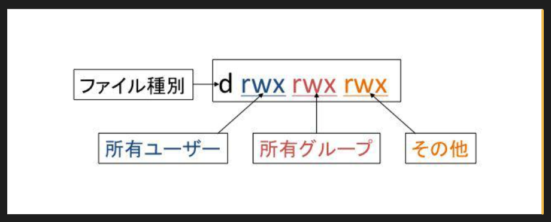

# 6 章 ファイルやディレクトリのアクセス制御

---

## 📚 [全体の目次に戻る](README.md)

Linux はマルチユーザー OS であるため、セキュリティ保護の観点からファイルやディレクトリにはアクセス制御が必要です。  
アクセス制御は「所有者」や「所有グループ」、それぞれに設定される **アクセス権** によって実現されます。

## 本章の内容

- ファイルの所有者と所有グループ
- ファイルとアクセス権

## 6-1 ファイルの所有者と所有グループ

- 各ファイルやディレクトリには **所有者（ユーザー）** と **所有グループ** が設定される。
- ファイルを作成した場合
  - 所有者 → 作成したユーザー
  - 所有グループ → そのユーザーのプライマリーグループ
- この所有権に基づきアクセス制御が行われる。

---

### 6-1-1 所有者と所有グループの確認

#### 概要

Linux のファイルには **所有者（ユーザー）** と **所有グループ** が設定されており、  
「誰が利用できるか、どんな操作ができるか」を管理する。

#### 確認方法

`ls -l` コマンドで確認できる。

```bash

$ touch test

$ ls -l test

-rw-r--r--. 1 linuc linuc 0 8月16 10:44 test

```

#### 表示内容

- -rw-r--r-- : アクセス権（ユーザー / グループ / その他）

- 3 番目の項目 : 所有者（例: linuc ユーザー）

- 4 番目の項目 : 所有グループ（例: linuc グループ）

#### ポイント

- 所有者 : ファイルの持ち主ユーザー

- 所有グループ : ファイルに関連付けられたグループ

- アクセス権はこれらに基づいて適用される

---

### 6-1-2 所有者の変更

## 概要

ファイルやディレクトリの **所有者** を変更するには `chown` コマンドを使用する。  
また、指定方法によって **所有グループ** も同時に変更できる。

> 所有者・所有グループの変更には **root 権限** が必要。

---

### 書式

chown [オプション] [ユーザー]:[グループ]] ファイル

#### オプション

- -R : 指定ディレクトリ以下を再帰的に変更

### 指定のパターン

- 所有者を変更

chown ユーザー ファイル

- 所有者と所有グループを変更

chown ユーザー:グループ ファイル

- 所有グループのみ変更

chown :グループ ファイル

#### 実行例

```bash

$ chown sato test
chown: 'test' の所有者を変更中: 許可されていない操作です

$ sudo chown sato test

$ ls -l test
-rw-r--r--. 1 sato linuc 0 8月16 10:44 test

```

- 一般ユーザーは直接変更できないため、sudo が必要

- 所有者が sato に変更されたことが確認できる

### 注意点

- 他人が所有するファイルを削除しようとすると確認が必要になる

```bash

$ rm test
rm: 書き込み保護されたファイル 'test' を削除しますか? y

```

---

### 6-1-3 所有グループの変更

#### 概要

- ファイルの **所有グループ** を変更するには `chgrp` コマンドを使う。
- 一般ユーザーは **自分が所属しているグループのみ** に変更できる。
- `sudo` を使えば **任意のグループ** に変更可能。

---

#### コマンド書式

chgrp [オプション] グループ ファイル

#### 主なオプション

- -R
- ディレクトリ内のファイルやディレクトリの所有グループを 再帰的に変更

#### 実行例

1. ユーザー情報確認

```bash

$ id
uid=1000(linuc) gid=1000(linuc) groups=1000(linuc),10(wheel)

```

2. ディレクトリ作成 & 所有グループ変更

```bash

$ mkdir testdir

$ chgrp wheel testdir

$ ls -ld testdir

drwxr-xr-x. 2 linuc wheel 6  8月16 10:57 testdir

```

- 所属グループ wheel に変更成功

3. 所属していないグループに変更

```bash

$ chgrp kvm testdir
chgrp: 'testdir' のグループを変更中: 許可されていない操作です


```

- 所属していないグループ kvm には変更不可

#### ポイントまとめ

- chgrp … ファイル/ディレクトリの所有グループ変更

- 一般ユーザー → 所属グループにのみ変更可能

- root 権限（sudo） → すべてのグループに変更可能

---

## 6-2 ファイルとアクセス権

### 概要

- ファイルのアクセス権は以下の 3 種類がある
  1. **読み込み (Read, r)**
  2. **書き込み (Write, w)**
  3. **実行 (eXecute, x)**
- アクセス権は **所有者、所有グループ、その他のユーザー** に対して設定可能
- ファイルのアクセス権は **パーミッション** または **モード** と呼ばれる
- 変更する場合は `chmod` コマンドを使用

---

### 6-2-1 アクセス権を確認する

- ファイルのモードは `ls -l` で確認可能
- 左端の文字列がアクセス権を示す



- 最初の `-` … ファイルの種類（`d` はディレクトリ）
- その後の 3 文字ごとに、**所有者 / 所有グループ / その他** のアクセス権を示す

#### アクセス権の数値対応

| 権限 | 8 進数 |
| ---- | ------ |
| r    | 4      |
| w    | 2      |
| x    | 1      |

- 合計値を計算して `chmod` で設定可能
  - 例: `rwx` → 4+2+1 = 7
  - `rw-` → 4+2+0 = 6

---

#### アクセス権の意味

- **r**: ファイルの読み込み可能 / ディレクトリの中身確認可能
- **w**: ファイルの書き込み可能 / ディレクトリ内の作成・削除可能
- **x**: ファイルをプログラムとして実行可能 / ディレクトリに入れる

---

### 6-2-2 アクセス権の変更

### 概要

- ファイルやディレクトリのアクセス権を変更するには `chmod` コマンドを使用

#### 書式

- chmod [モード[, モード]...] ファイル

- chmod [8 進数表記のモード] ファイル

#### オプション

- `-R`  
  指定したディレクトリ内のファイルやディレクトリを再帰的に変更

#### モードの指定方法

1. **ユーザー種別ごとのモード書式**
   - `u` (所有者), `g` (グループ), `o` (その他) を組み合わせて指定
   - 例: `chmod u+r,g-w file.txt`
2. **8 進数 3 桁でまとめて指定**
   - 所有者・グループ・その他の権限をそれぞれ 1 桁で指定
   - 例: `chmod 754 file.txt`
     - 所有者: 7 (rwx)
     - グループ: 5 (r-x)
     - その他: 4 (r--)

---

### 6-2-3 モード書式によるアクセス権の設定

### 概要

- `chmod` コマンドで、ユーザー種別ごとにアクセス権を設定・追加・取り消しできる
- ユーザー種別:
  - `u`：所有者
  - `g`：所有グループ
  - `o`：その他のユーザー
  - `a`：全てのユーザー（u, g, o の省略形）
- 権限の種類:
  - `r`：読み込み
  - `w`：書き込み
  - `x`：実行（ディレクトリの場合は中に入れる）

---

#### 権限の指定方法

- `=`：設定（指定した権限のみを適用）
- `+`：追加（既存権限に追加）
- `-`：取り消し（指定した権限を削除）

---

#### 実行例 1：ファイルにグループの書き込み権限を追加

```bash

$ touch test

$ ls -l test
-rw-r--r--. 1 linuc linuc 0 8月16 14:24 test

$ chmod g+w test

$ ls -l test
-rw-rw-r--. 1 linuc linuc 0 8月16 14:24 test

```

#### 実行例 2：ディレクトリにグループとその他ユーザーの書き込み権限を追加

```bash

$ ls -ld testdir
drwxr-xr-x. 2 linuc wheel 6 8月16 14:25 testdir

$ chmod g+w,o+w testdir

$ ls -ld testdir
drwxrwxrwx. 2 linuc wheel 6 8月16 14:25 testdir

```

---

### 6-2-4 8 進数によるアクセス権の設定

#### 概要

- ファイルやディレクトリのアクセス権を 8 進数で指定する方法
- アクセス権を数値に置き換えて、`3桁`で指定する


#### アクセス権と 8 進数の対応

| 権限 | 値  |
| ---- | --- |
| r    | 4   |
| w    | 2   |
| x    | 1   |

- 設定方法：各ユーザー種別（所有者・グループ・その他）ごとに権限値を合計して 3 桁の数字で指定
  - 例: `rw-rw-rw-` → 4+2=6（所有者）、4+2=6（グループ）、4+2=6（その他） → `666`
  - 例: `rwxr-xr-x` → 4+2+1=7（所有者）、4+0+1=5（グループ）、4+0+1=5（その他） → `755`

---

#### 実行例 1：ファイルのアクセス権を変更

```bash

$ ls -l test
-rw-rw-r--. 1 linuc linuc 0 8月16 14:24 test

$ chmod 666 test

$ ls -l test
-rw-rw-rw-. 1 linuc linuc 0 8月16 14:24 test

```

#### 実行例 2：ディレクトリのアクセス権を変更

```bash

$ ls -ld testdir
drwxrwxrwx. 2 linuc wheel 6 8月16 14:25 testdir

$ chmod 755 testdir/

$ ls -ld testdir
drwxr-xr-x. 2 linuc wheel 6 8月16 14:25 testdir

```

- 「755」と指定したので、アクセス権は `rwxr-xr-x` となった

---

### 6-2-5 アクセス権変更によるアクセス制御の確認

### 概要

- アクセス権を変更することで、ファイルやディレクトリへの操作が制限されることを確認する

#### ファイルの書き込み制限の確認

1. 書き込み可能な状態で文字列を書き込み

```bash

$ ls -l test
-rw-rw-r--. 1 linuc linuc 0 8月16 14:24 test

$ cat > test
Write Test.
（Ctrl+d で終了）

$ cat test
Write Test.

```

2. 所有者の書き込み権限を削除

```bash

$ chmod u-w test

$ ls -l test
-r--rw-r--. 1 linuc linuc 12 8月16 18:10 test

$ cat > test
-bash: test: 許可がありません

```

- 書き込み権限がなくなったため、書き込みできなくなった

#### ディレクトリの書き込み制限の確認

1. 書き込み可能なディレクトリ内でファイル作成

```bash

$ ls -ld testdir
drwxr-xr-x. 2 linuc wheel 6 8月16 14:25 testdir

$ touch testdir/test

$ ls -l testdir
合計 0
-rw-r--r--. 1 linuc linuc 0 8月16 18:21 test

```

2. ディレクトリの書き込み権限を削除

```bash

$ chmod 555 testdir

$ ls -ld testdir
dr-xr-xr-x. 2 linuc wheel 18 8月16 18:21 testdir

$ touch testdir/test2
touch: 'testdir/test2' に touch できません: 許可がありません

```

- 書き込み権限がなくなったため、新しいファイルを作成できなくなった

---

◀ [5 章へ](05_user_and_group_management.md) | 📚 [全体の目次](README.md) | [7 章へ](07_network_configuration_and_management.md) ▶

---
